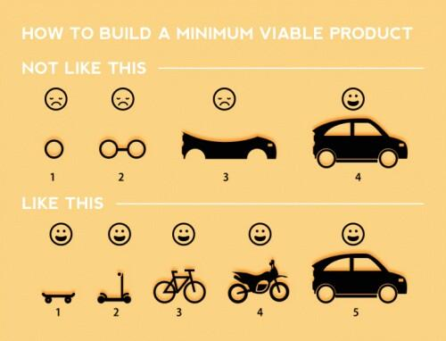

# Final Projects

The final project is a large front end application that should showcase your
abilities as a developer and be the capstone of your portfolio. You will present
the application on Demo Day (Friday, March 27th).

The purpose of the final project is to showcase your abilities as a developer,
not to create the Next Big Thing (if you can do both, kudos). Make sure to
decide beforehand what you think your greatest strengths are and use your
application and presentation as a platform to showcase those strengths.
Together, your final project and portfolio should tell a story about what sets
you apart from other developers so that you can stand out when seeking
employment.

For example, if you have graphic design background, you should nail the graphic
design in additional to the technical aspects so that you can tell the story of
your diverse experience. If you have business acumen, you could develop an idea
that shows your ability to create a viable business idea and execute a minimum
viable product quickly. This doesn't have to be anything spectacular, just
choose some strength about yourself that you can showcase with the application
idea or the technical choices you make. Ask your instructor if you need help
with this.

## Requirements:

- You may either do the project by yourself or with a partner. If you choose to
  work with a team, you must follow the Team Requirements as well.
- You must make regular commits each day (at least one commit per person per day).
- You must have `"use strict";` in your code.
- You must use either Ember.js or Backbone.js (or another MV\* front end
  framework, if you'd like to learn another one).
- Your app must save data, not just pull it down.
- Your app must have user authentication and authorization, unless you receive
  written permission from the instructor.
- Your UI must be **responsive** and work on both desktop and mobile
- Your Project proposal to your instructor must start with an elevator pitch:
    - 15 to 25 words of what your app does
- You must utilize the processes discussed in the abbreviated Thoughtbot
  playbook, including sketches, static mockups, Trello boards, etc..
- Additionally, you must document at least 8 user stories about your app.

    > "As an admin user, I want the ability to create courses so that learners
    > can see what courses are available."

    User stories follow this structure: "As a ________ I want _______ so that
    ________"

- You must produce scenario descriptions for these user stories, as well.

  > Given I am logged in as an admin user
  > When I click on the "Create Course" button
  > Then I should be on the "Create Course" screen.

  > Given I am on the "Create Course" screen
  > When I fill out the course name input with "Cool Course"
  > And I click on the "Create Course" button
  > Then I should be on the course listings page
  > And I should see "Cool Course"

- You must research your API to ensure it supports CORS or JSONP. If it doesn't,
  you'll need a server-side proxy. If a server-side proxy might be needed, **you
  need to verify this immediately and let your instructor know**.
- You must write a README that lists all the technologies and APIs used in the
  project.
- Your application must be deployed to GitHub Pages and the URL for the deployed
  site should be in your README, in your repo description, or both.

## Team Requirements:

- You must have a total of 16 user stories for your application. If you have
  trouble coming up with 16, your application idea is probably too small for two
  people.
- You must report which user stories are going to be completed by each person
  during the morning standup meeting.
- You must split the user stories approximately evenly between the two
  developers so that each developer is working on the full stack (HTML, CSS, JS,
  Ember, Parse, etc.)

## Pitching The Projects

Start thinking about final projects a week ahead of time, and meet with your
instructor if you're devoid of ideas. 

Make your projects are centered around things you truly care about; bee-keeping,
beer, dancing, hiking, basketball, etc. This makes a huge difference and can
make the project a lot of fun.

## Ask your peers for feedback

Community feedback is invaluable in keeping scope-creep out and making sure the
projects are the right mix of ambition, talent, feasibility, and hubris (a
careful mixture of all four is required, IMHO).

Peer code reviews are also extremely helpful.

## Start Small, Grow with Agility

> see
> https://pickcrew.com/how-to-build-an-online-business/balance-design-and-launching-early/
> for more on this.

## Final Project Q&A

1. Where do we have to be during final projects? In the lab? Home?

    Monday through Thursday, be at The Iron Yard's office by 10am for a short
    standup meeting. We will be holding some small lectures here and there, and
    I will be helping to answer questions. **If you don't show up, ask
    questions, and drive your project in this crucial 3-week period, you won't
    receive career support.**

    Fridays you will be free to work from home. (But we'll still have
    `#IronPints™`)

- How often will lectures happen, and will they be optional?

    They will happen probably two to three times each week; in the mornings.
    Some lectures will be optional, some will not. I will let you know in Slack
    ahead of time.

- How long will lectures be?

    They will be kept to a maximum of 1.5 or 2 hours.

- How often do we check in with the instructor? What about the campus director?

    You must check in with your instructor each morning with a standup. Once or
    twice each week, you should also be checking in with the campus director to
    discuss career support.

- How much job-related stuff should I be doing?

    This is a case-by-case basis, but The Iron Yard staff will be sharing
    job-related resources to help kickstart the job search process. Best rule of
    thumb:

    - During final projects, do only two 1-hr job searches each week. That
      means, pick two evenings (Tues, Thurs), schedule them on your calendar
      (to get alerts so you don't forget), and don't do anything more.
    - During final projects, spend a little time every day (25 minutes?) working
      on your portfolio. Schedule this on your calendar.

- What happens if I don't finish my project?

    You don't present at Demo Day; and you'll have to complete it after class
    ends.

- If I don't finish, will I receive career support?

    Not until you finish the project (you get to do that after class) and show
    you worked hard. The real hustle begins after class, when you start the job
    hunt.

## Demo Day Notes
1. Make sure to close all unnecessary applications and disable Notifications so
   you don't get text messages during your presentation.
2. Fill out forms before the presentation
3. Use Incognito mode if you need to be logged in as more than one user.
4. Explain the most interesting and challenging problems you encountered and how
   you overcame them.
5. Make sure to outline the libraries and frameworks that you used.
6. Give a short outline of your prior experience
7. Say your full name loudly and clearly
